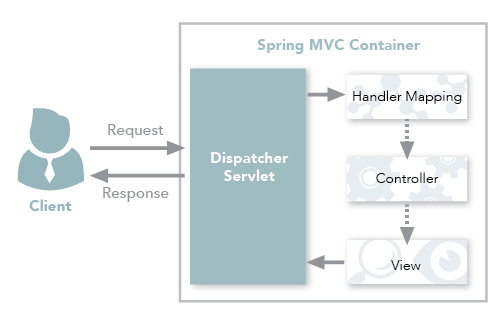

# Financial API Documentation

This API is a prototype to provide financial services for the back-office of an institution. The design, development and roadmap is intended to demonstrate a software development rationale based on best practices.

Questions to this works should be sent to `pcosta@gmail.com`.

# Build and Development

### Requirements
1. JDK 8
2. Apache Maven 3.5.0
3. Inspect `pom.xml` in the root directory to check each JAVA dependency

### Build
1. Clone git repository
```
git clone https://github.com/pedraumcosta/financialapi.git
cd financialapi
```

2. Run integration tests
```
mvn verify
```

### Run
1. Run spring boot server to use the service.
```
mvn spring-boot:run
```
2. Inspect swagger
```
mvn spring-boot:run
Open your browser to:  http://localhost:8080/swagger-ui.html
```

# Solution Design
Nowadays any digital business asset must be provided as an API. Read more about the API Economy: `https://www.ibm.com/cloud/api-economy`

Even before this definition exploring a business perspective, there were frameworks that maximize the value delivered by developers at higher speeds. Basically, we want a rich set of tools allowing us to create, run, manage and secure our business functions as APIs. It is desired at least the following features, but not limited to:
- API externalization
  * API exploration
  * Self-service sign up
  * Interactive API testing
  * App key provisioning
  * API usage analytics
  * Rate limit notification
  * Multiple dev communities
- API realization
  * Multi-tenancy
  * Rate limiting
  * Runtime policy enforcement
  * API Deployment
  * OAuth secutiry management
  * Data transformation/redaction
  * Backend service discovery
  * Version Management
  * Analytics support
  * Role-based access control
  * Environment management
  * Monitoring and notification

Usually we call such solutions as API Gateways. It's difficult to separate these solutions from some cloud offerings. In fact, the combination of a comprehensive cloud solution and a good API framework may offer the best tradeoffs, since the cloud will provide additional resources, both to developers and infra people.
## Spring Boot
With this in mind and to particularly achieve a rapid value deliver by means of TTD development approach, this prototype was built with Spring Boot, which includes a lightweight server to be used locally and have a reduced boiler plate with remarkable performance. In this way the developer can work very fast and has at his disposal a very rich set of tools:
  - External Configuration
  - Logging
  - Embedded Containers
  - Database connectors for JPA
  - JMS
  - Auto-configuration
  
Additionally, Spring Boot is very flexible in terms of deployment, so, with minimum adaptations the code in this repo can be enhanced to be used in one of the deployment options discussed later in this `README`. As a classical Request-Response framework, Spring Boot uses MVC pattern, therefore the this how Financial API is built upon .



**OBS:** The Spring Boot choice can also leverage a bigger system based on Microservices, which is one of the big goals of the framework.
## Deployment Options


# Other API's implementation
# Possible Roadmap
descrever o mercado financeiro, os problemas, drivers e depois sugestão de arquitetura final
# Current version issues and limitations
- No API authentication
- The account names are being used as an account identifier, since they are strings and this implementation use H2 Database they can overlap.
- Status Transfer is not being used in all possible cases.
